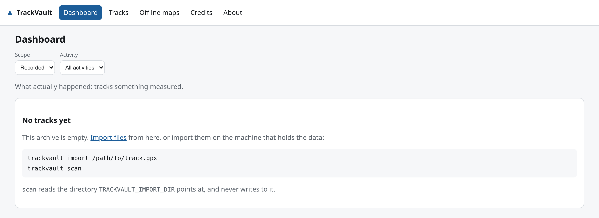
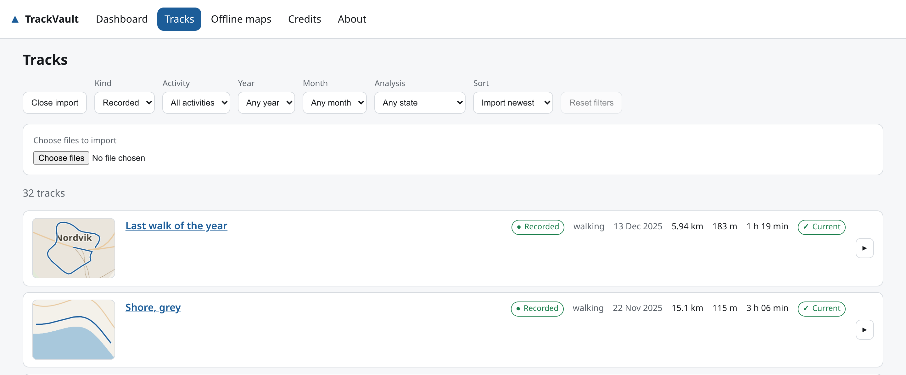
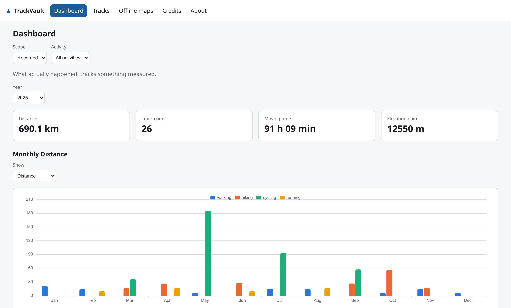
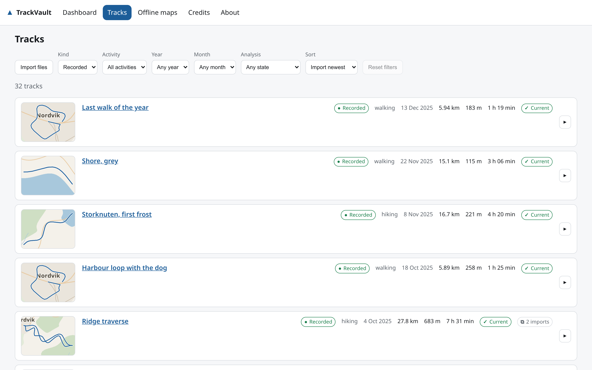
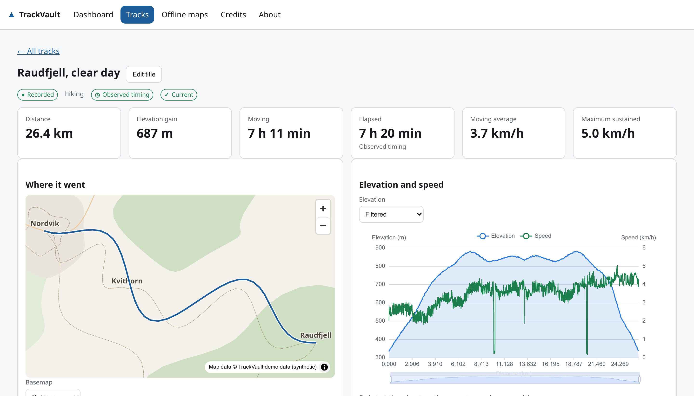
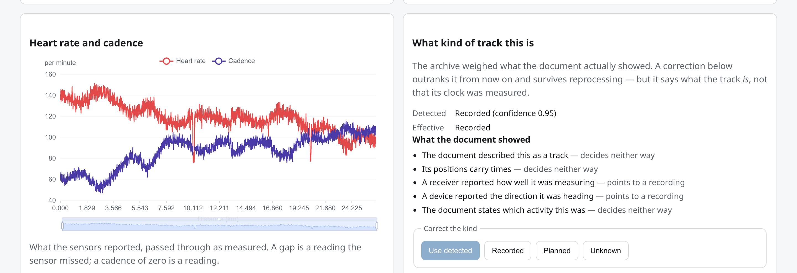
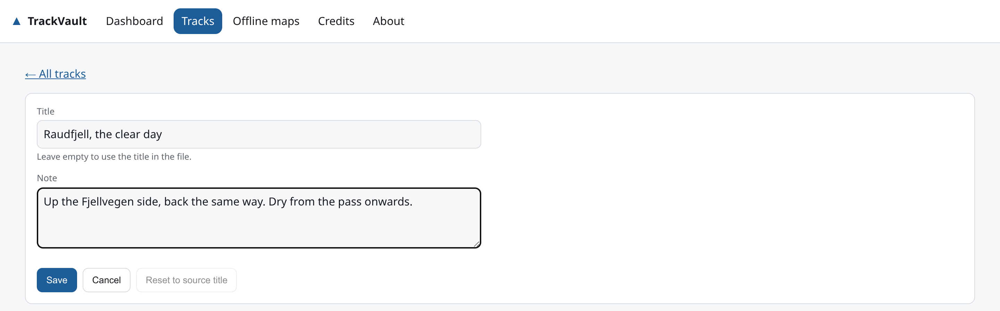
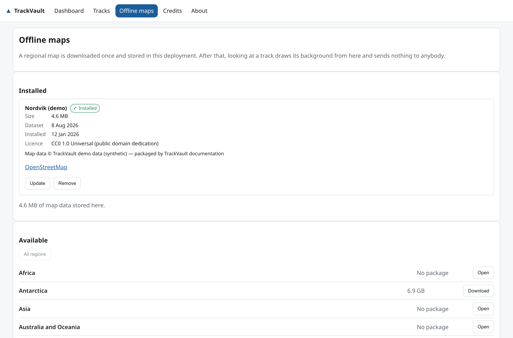

# The TrackVault user guide

This is the guided tour: what TrackVault is for, how to get your first tracks
into it, and what every screen is telling you. It is meant to be read once, from
the top, by somebody who has just installed it.

Most sections end with a link to the document that covers that topic properly.
This guide stays on the surface on purpose — it shows you the road, and the
other documents are the map.

> **About the pictures.** Every screenshot here comes from a demo archive that
> was generated on the spot: an invented island called Nordvik, invented walks
> and rides across it, and a hand-drawn basemap. None of it is anybody's
> movement data. See [Where the screenshots come from](#where-the-screenshots-come-from)
> at the end.

---

## 1. What TrackVault is

TrackVault is a **personal archive for activity tracks**, running on a machine
you control.

You record a walk, a ride or a run with whatever app you already use. You export
it as a GPX file. TrackVault takes that file, keeps it exactly as it is forever,
works out what it was and what it did, and shows you the result — on a map, in a
chart, and as a year of totals.

What it deliberately is not:

- **Not a service.** There is no account, no sync with a company, no upload to
  anybody. It talks to the internet for exactly one thing: downloading an
  offline map, when you press the button.
- **Not a social network.** No feed, no followers, no segments, no leaderboards.
- **Not a tracker.** It does not record anything itself. It is the shelf you put
  recordings on.

The idea behind it is that a record of where you have been should outlive the
app that produced it. So the original file is never modified, never replaced by
a "processed" version, and never locked into a format only TrackVault reads.

---

## 2. Installing it

You need Docker. You do not need Python, Node, or a copy of the source.

```bash
mkdir trackvault && cd trackvault
curl -fsSL https://github.com/basecubedev/trackvault/releases/latest/download/install-docker.sh -o install-docker.sh
sh install-docker.sh
```

That writes a `docker-compose.yml`, a `.env` and three folders, pulls the image
and starts it. Then open **<http://localhost:8081/>**.

> **Run it on a network you trust.** There is no login screen yet. Anybody who
> can reach the port can read your archive and add files to it. Keep it on your
> home network or behind something that does ask for a password.

→ [Installation](installation.md) — every installer flag, Windows and macOS,
running from a source checkout, and updating.

---

## 3. The first thing you see

A fresh archive is empty, and says so rather than showing you four zeroes.



This is worth noticing, because it is the first example of a rule that runs
through the whole product: **a number that cannot be worked out is missing, not
zero.** An empty archive has no distance — it does not have a distance of 0 km.

---

## 4. Getting your tracks in

There are three ways in, and they all end up in the same place. Pick whichever
suits you; you can use all three.

### From your phone, automatically

This is the setup TrackVault was built for:

```
Your recording app (Locus Map, and others)
        ↓  AutoSync / Syncthing / Nextcloud / rsync
a folder on the host, e.g. ~/sync/locus
        ↓  mounted read-only as import/
trackvault scan
```

Point your phone's sync target at the `import/` folder the installer created, or
point TrackVault at a folder you already sync to by setting
`TRACKVAULT_IMPORT_PATH` in `.env`. Then, whenever you want to take in whatever
has arrived:

```bash
docker compose exec trackvault trackvault scan
```

```
imported  a95629ddc1ae tracks=1  morning-ride.gpx
duplicate 4f2b91c00de1            yesterday.gpx
```

Every file gets its own answer. A file already in the archive is recognised by
its content and skipped — so a sync folder that never clears itself does not
turn into forty copies of one ride. **The import folder is never written to**:
nothing in it is renamed, moved or deleted, and the mount is read-only as well.

### From the command line

```bash
docker compose exec trackvault trackvault import /import/some-ride.gpx
```

### From the browser

Press **Import files** at the top of the Tracks page and choose one or more
files.



You can switch this off with `TRACKVAULT_UPLOAD_ENABLED=false` in `.env`, which
is worth doing if the port is reachable by anybody you would not hand the
keyboard to.

### Where do I get a GPX file?

TrackVault connects to no service, so there is nothing to authorise — you export
a file and import it.

| Where the track is now | How to export it |
| --- | --- |
| Locus Map | Track or route → **Export** → GPX |
| komoot | Tour → **Export GPX** |
| Strava | Activity → **Export GPX** |
| Garmin Connect | Activity → **Export to GPX** |

→ [Importing and exporting](importing.md) — the full command list, the phone
sync walkthrough, scheduling a scan, and the three ways to get data back out.

---

## 5. The dashboard

The dashboard answers one question at a time: **what did I do in this year?**



Things worth knowing about this page:

- **The year is the archive's newest, not today's.** If your last import was from
  2025, the dashboard opens on 2025 rather than on an empty current year.
- **Scope is not a filter, it is a question.** *Recorded* means tracks something
  actually measured. *Planned* means routes somebody drew. *Unknown* means the
  evidence did not decide. They are never added together — a total that mixed a
  planned route into your travelled distance would be about neither.
- **One bar per activity per month.** A month of cycling and a month of walking
  are two answers, not one sum. A month you did not cycle shows a dash, not a
  zero.
- **Open** on a month row lists exactly the tracks that month counted. Not a
  filter the browser worked out afterwards — the same set.
- The year selector also offers **All years**, which draws one bar per year.

→ [Reading the data](reading-the-data.md) — every metric, and the four that are
deliberately not what the obvious formula would give.

---

## 6. The track list



Every filter lives in the address bar, so a filtered view is a link you can send
to yourself and a refresh does not lose it.

- It opens on **Recorded**, because opening an archive is nearly always a
  question about what you actually did. The *Kind* filter still offers Planned,
  Unknown and All kinds.
- Each row draws **a small map of where that track went**, over the same offline
  basemap the track's own page uses. Rows draw when you scroll to them.
- With a region catalog loaded, a row also says **roughly where it was** —
  `≈ Zeeland · Netherlands`. The tilde is not decoration: it is a comparison of
  rectangles, which is right well inside a country and wrong near a border.
- **"2 imports"** on a row means the same recording arrived in two different
  files — the same ride exported twice, in two formats, say. Both files are
  kept, because the bytes are different evidence and one format carries readings
  another cannot; the badge is on every row involved, so you can see that they
  are one afternoon rather than two. It is an *equality* — identical positions
  at identical instants — so it never guesses that two rides are one.
- The **arrow at the right of a row** opens that track's whole page inside the
  list, so looking for the right track is scrolling rather than a page load and
  a back button each time.

---

## 7. One track



The top of the page is the summary: how far, how much climbing, how long moving,
how long in total, and two speeds.

Under it, side by side:

- **Where it went** — the route over your own offline basemap. Nothing is
  requested from any tile service; the map comes from a package on your disk.
  *Basemap* switches between Outdoor, Light and no background at all.
- **Elevation and speed** — the profile against distance. Point at the chart and
  the matching position is marked on the map, and vice versa.

The badges under the title say what the archive is prepared to claim:

| Badge | Meaning |
| --- | --- |
| **Recorded** / **Planned** / **Unknown** | What kind of track this is |
| **Observed timing** | Its clock was shown to have been measured, so durations are time somebody spent |
| **Current** | Its numbers come from the algorithms this build actually runs |

If a track's numbers came from an older algorithm, the headline figures are left
blank and the page says why — while the map and the chart, which are derived
right now, stay exactly right.

### What the archive concluded, and why



If the recording carried **heart rate or cadence**, they get their own chart,
passed through exactly as the sensors reported them. A gap is a reading the
sensor missed; a cadence of zero is a reading, not a gap.

Beside it, **what kind of track this is** shows its work. Every piece of
evidence the document carried is listed with what it argued for. Notice that
several of them decide nothing on their own: a file having timestamps does not
make it a recording, because a route planner writes plausible times onto
geometry nobody travelled.

If the archive got it wrong, press **Recorded**, **Planned** or **Unknown**.
Your correction outranks the automatic answer from then on and survives
reprocessing; **Use detected** hands the decision back.

### Your own title and notes



The title on a track is the one in the file. Press **Edit title** to give it
your own, and to keep a note.

The file keeps saying what it said — your title is stored beside it, not written
into it — and **Reset to source title** hands the display back to the document.

---

## 8. Offline maps

Until you install a map, tracks are drawn over a plain background. That works,
but it is not much of a map.



Open **Offline maps**, find the region you walk in, and press **Download**. It
is fetched once, from [Geofabrik](https://download.geofabrik.de/), and stored in
your own data directory. From then on, opening a track reaches no tile service
at all.

That is the point of doing it this way. A public tile server would learn where
you walked one request at a time, which is exactly what a self-hosted archive
exists to avoid — so the provider is contacted for the three things you press:
refresh the catalog, install, update.

Regional packages are large. A country is typically several gigabytes; check the
size the page shows before you press Download.

Map data is **© OpenStreetMap contributors** under the Open Database License
1.0, packaged by Geofabrik GmbH. The attribution comes out of the package
itself, and is shown beside every map and on the `/credits` page.

→ [Offline maps](maps.md) — picking a region, updating one, storage, attribution.

---

## 9. Keeping it

Your archive is the only copy of a lot of afternoons. Two commands:

```bash
docker compose exec trackvault trackvault backup create
docker compose exec trackvault trackvault restore /backups/<name>.tar.gz
```

A backup is one file holding the database and every original, with a checksum
per part. It is checked by reading it back through the restore validation before
it reports success, so a backup that says it worked has already been proved
restorable. Installed offline maps are left out — that is public data you can
download again — and the manifest says so.

> A backup is your whole movement history in one file. Look after it the way you
> look after the archive.

To update TrackVault:

```bash
docker compose exec trackvault trackvault backup create   # 1. first, always
docker compose pull                                       # 2. get the new image
docker compose up -d                                      # 3. start it
```

Migrations run at start-up. Going back to an older version is refused rather
than guessed at, which is why step 1 is step 1.

→ [Backup and restore](backup-and-restore.md), including `trackvault doctor`,
which reports what is wrong with a deployment and changes nothing.

---

## 10. When something looks wrong

A few things that look like faults and are not:

| What you see | What it means |
| --- | --- |
| A metric is **—** instead of a number | It could not be derived from this track. Not zero: absent. |
| A planned route has **no moving time** | Nobody moved. `0` would claim somebody did. |
| A track belongs to **no month** | Its timestamps were not shown to have been measured, so the archive will not say which month the activity happened in. Its distance is still counted where distance is counted. |
| A total says it **left tracks out** | Those tracks' numbers came from algorithms this build no longer runs. Run `trackvault analyze --outdated`. |
| A row says **"2 imports"** | One recording, two files. See [the track list](#6-the-track-list). |

→ [Troubleshooting](troubleshooting.md) — the failures that look like something
else.

---

## 11. What it does not do yet

Stated plainly, because a feature list that only lists wins is not useful:

FIT, TCX, KML and GeoJSON files cannot be imported yet — GPX is the one exchange
format. There are no personal records, lifetime totals, splits or gradients. The
elevation is not corrected against a terrain model. Two recordings of the same
loop on different days are not recognised as the same route. There is no
authentication, and no file-system watcher — a scan is something you run.

---

## Where to go next

| For | Document |
| --- | --- |
| Installing, updating, running it | [installation.md](installation.md) |
| Getting tracks in and out | [importing.md](importing.md) |
| Offline maps | [maps.md](maps.md) |
| Backup, restore, `doctor` | [backup-and-restore.md](backup-and-restore.md) |
| Settings, storage, security | [configuration.md](configuration.md) |
| The pages, the metrics, the API | [reading-the-data.md](reading-the-data.md) |
| When something is wrong | [troubleshooting.md](troubleshooting.md) |

---

## Where the screenshots come from

Not from a real archive. A screenshot of an activity archive is a picture of
where somebody goes, and this project does not put that in a repository — not
even its own author's.

So the documentation has an archive of its own. `web/scripts/demo_region.py`
describes an invented island in the open North Atlantic: a coastline, four
settlements, four hills, a road network and a set of trails. `demo_archive.py`
walks that network thirty-five times over two invented years, writes the result
as GPX documents, imports them through the ordinary import path, and draws the
island as a real offline map package which it installs through the ordinary
installation path. `npm run screenshots` then drives the actual application in a
real browser and writes the images you have been looking at.

So the pictures are of the real product, over a place that does not exist.

The one exception is the region list on the Offline maps page, which is the
genuine catalog from Geofabrik — inventing regions under somebody else's name
would be a claim a screenshot should not make.
